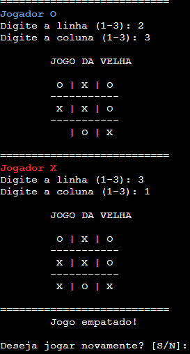

# 🎮 Jogo da Velha em Linguagem C

Este projeto consiste na implementação do clássico **Jogo da Velha** utilizando a Linguagem C. O programa foi desenvolvido como atividade acadêmica com o objetivo de praticar conceitos fundamentais de programação, como estruturas condicionais, laços de repetição, matrizes e validação de entradas.

O jogo é executado diretamente no terminal, permitindo que dois jogadores disputem uma partida alternando entre os símbolos **X** e **O** até que haja um vencedor ou ocorra empate.

<p align="center">
  
  
</p>

---

# 🧠 Conceitos Praticados

Durante o desenvolvimento deste projeto foram aplicados diversos fundamentos da programação:

- Matrizes Bidimensionais
- Estruturas Condicionais
- Laços de Repetição
- Funções
- Validação de Entrada
- Lógica de Jogos
- Manipulação de Variáveis

---

# 🎲 Funcionalidades

✅ Exibição do tabuleiro no terminal

✅ Alternância automática entre os jogadores

✅ Validação de posições já ocupadas

✅ Verificação de vitória em linhas

✅ Verificação de vitória em colunas

✅ Verificação de vitória em diagonais

✅ Detecção automática de empate

✅ Interface simples e intuitiva

---

# 🖥️ Exemplo de Execução


<p align="center">
  
</p>


# 📋 Regras do Jogo

1. O jogo é disputado por dois jogadores.
2. Cada jogador escolhe uma posição livre do tabuleiro.
3. Os jogadores alternam entre os símbolos **X** e **O**.
4. Vence quem completar:
   - Uma linha;
   - Uma coluna;
   - Uma diagonal.
5. Caso todas as posições sejam preenchidas sem vencedor, o resultado será empate.

---

# ⚙️ Como Executar

### Compilar o programa

```bash
gcc jogo_da_velha.c -o jogo_da_velha
```

### Executar

```bash
./jogo_da_velha
```

---

# 🎓 Importância Acadêmica

O Jogo da Velha é um dos exercícios mais tradicionais para o aprendizado de programação, pois reúne diversos conceitos fundamentais em um único projeto.

Sua implementação permite desenvolver habilidades relacionadas a:

- Pensamento lógico
- Resolução de problemas
- Manipulação de matrizes
- Estruturas de controle
- Organização de algoritmos
- Desenvolvimento de software

---

# 🚀 Aprendizados

Este projeto contribuiu para o desenvolvimento das seguintes competências:

- Estruturação de programas em C
- Controle de fluxo de execução
- Criação de regras de negócio
- Interação com o usuário
- Organização e legibilidade de código

---

# 📂 Estrutura do Projeto

```text
Jogo-da-Velha/
│
├── jogo_da_velha.c
├── README.md
└── .gitignore
```

---

# 👩‍💻 Autora

**Karina Beilich**

GitHub: https://github.com/KarinaBeilich

---

> 🎯 Projeto desenvolvido para praticar lógica de programação e estruturas fundamentais da Linguagem C através da implementação de um dos jogos mais clássicos da computação.
